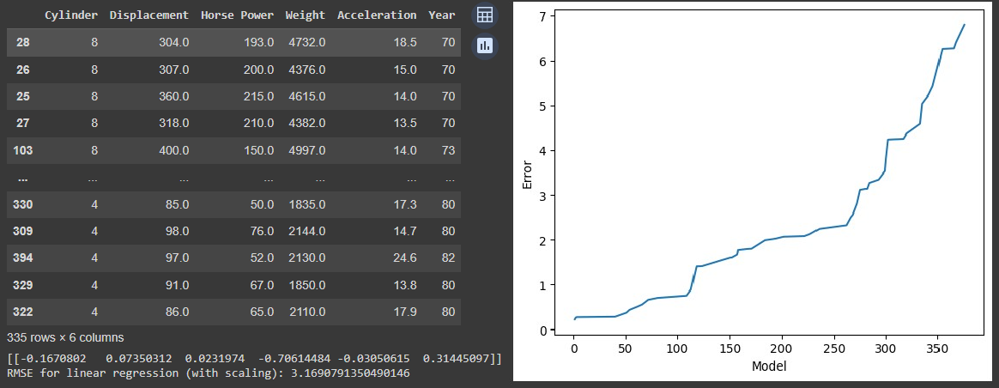
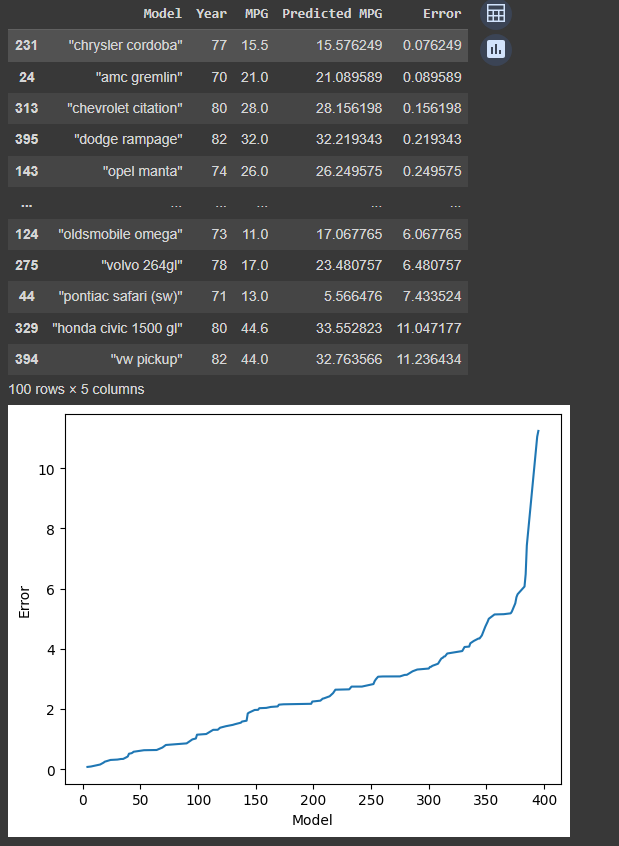
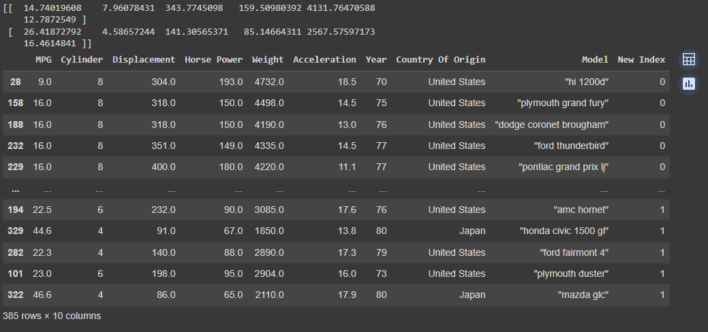
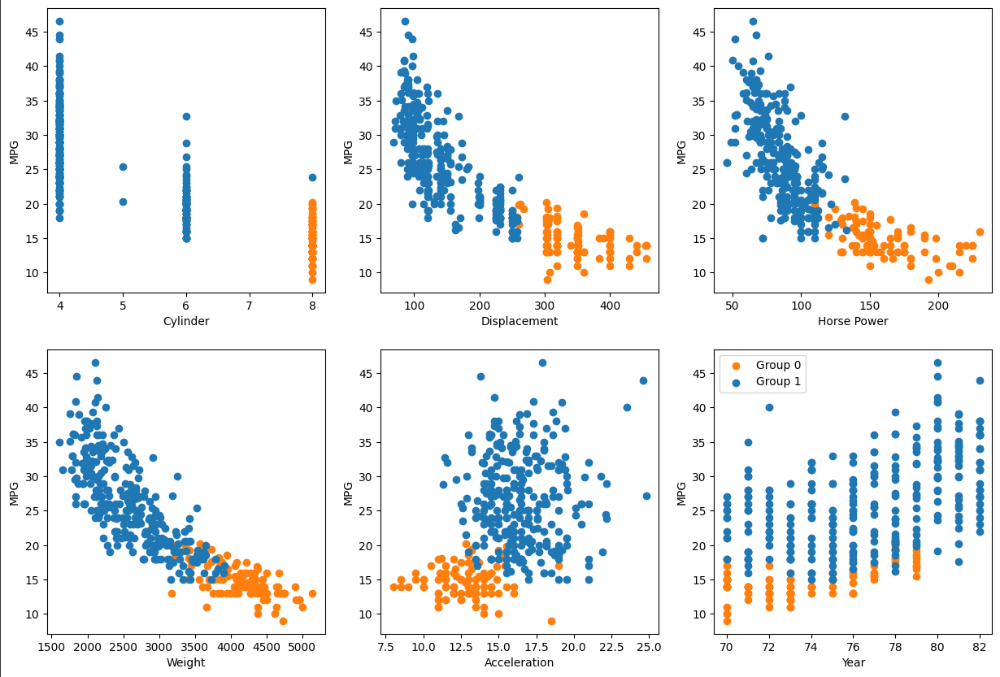
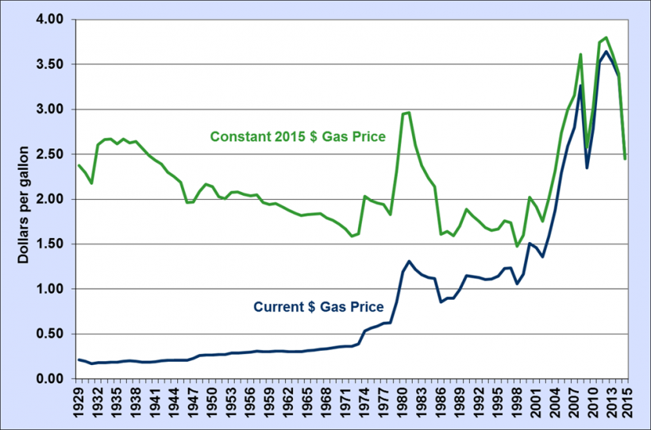
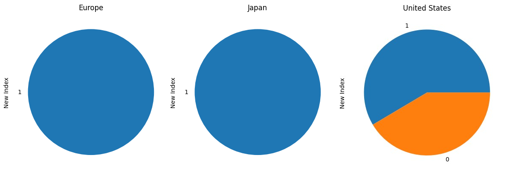

## The Cars of the World 1970 - 1982

This is an analysis of internal combustion automobiles of various national origins. This analysis will focus on identifying factors influencing fuel efficiency and stereotyping cars. 

***

## Introduction 

This dataset embodies a critical point in automotive history where due to the 1973 Oil Crisis and strengthening air quality controls american car makers were forced to downsize and promote efficiency. Exploring this period might offer relevant information to the current task of emissions reduction. We might also learn about the historical transformation these cars underwent.  

The techniques  of analysis used are linear regression and k means clustering. First, we will use linear regression to try and predict fuel efficiency of cars from the qualities described by the data set. Then, we will use K means clustering to create car stereotypes and examine what composes them.

We did this to solve the problem. We concluded that...

## Data

The data used comes from the UCI machine learning repository linked here: https://archive.ics.uci.edu/dataset/9/auto+mpg
It is a space separated data file containing a list of qualities of 398 cars from the United States, Europe, and Japan. 
The qualities listed in order: combined fuel efficiency in miles per gallon, number of cylinders, displacement in cubic inches, horse power, weight in pounds, zero to sixty in seconds, model year, place or origin, and model name. 

The data as received required some correction and paring down. Some horsepower data was missing and was corrected via google search. The data set contained 9 diesel and 3 rotary engine cars which were thrown out in order not to throw off a fuel efficiency prediction, diesel engines are naturally more fuel efficient than gas engines, while rotary engines are highly inefficient for their small displacement. I would have liked to make diesel another attribute to predict fuel efficiency from however, the small sample size makes this futile.

## Ridge Regression

For ridge regression we use every quantity (discarding model name and origin) provided to predict fuel efficiency. First we sample 50 random cars without replacement to be our test cars, the remainder are put into the training pool. The benefit of this randomness is the ability to continually resample and make sure the level of error in our predictions isn't a fluke of the specific cars sampled. This also has a knock on effect of giving us a more accurate idea of the appropriate weights for our quantities. If I had more time this would be systematized to give average error and weights or I would have found a way to expand the dataset making this irrelevant. Once we have our training and test data we scale the data and run ridge regression.

[On the left is a sample of training data, scaled element weights, and root mean squared error.
On the right is a distribution of error across models tested sorted least error to most error.
The element weights are in order with the elements of the training data.]

We can see that our model is concentraiting everything into the weight and model year elements. This makes some sense, increased weight means an increased inertia that must be overcome with a loss of fuel efficiency. On the other hand, as the 70s progressed the oil crisis and clean air regulations drove the efficiency of new cars up year after year. We will further confirm these relationships in the K means section. What doesnt make any sense is the lack of weight in any of the elements associated with the engine. Why dont cylinder count, displacement, or power seem to describe efficiency? Why do non american cars always top the error distribution? Lets now examine only american cars. 

[This is another sample of training data with only american cars.]

After eliminating all foreign cars from the data set the RMSE descends from near 3 to near 2. We can also see that the weight is less concentraited into just the weight and model year. The elements, cylinder number, displacement, and acceleration have become more relevant. The only element still without weight is power. The foreign cars clearly threw off the ridge regression predictions, however it is not clear to me why this is the case. The issue could lie with small foreign sample size, some sort of data issue like use of imperial rather than U.S gallons, or superior fuel efficiency in small foreign engines making the connection between displacement and efficiency less obvious.  

## K Means Clustering

We cluster using cars from every nation and using every quantity we have save model year. The data is scaled appropriately before clustered, otherwise the data would cluster solely around weight due to its larger magnitude.

[Arrays containing the centers of clusters zero and one. Table of cars with cluster assignment. The numbers in the array are ordered like the elements of the table.]

Group zero is made up of big fast gas guzzlers, while group one are fuel efficient small displacement slow cars. We will call group zero "land yachts" and group one "econoboxes". 

[Six scatter plots with a car element input and efficiency output. Cluster zero points are orange. Cluster one points are blue.]

These graphs suggest the best way to categorize the clusters is through cylinder count, displacement, and power. These categories give the clusters the least overlap. Acceleration is the most muddy element with pleanty of cluster overlap, this suggests the big gas guzzlers dont actually go much faster than smaller cars.

We can clearly see the negative correlations with efficiency in the first 4 graphs. We can also see a clear positive correlation between year and efficiency. This poses a possible reason for the conspicuous weight placed upon weight and year, weight and year span the vector space with the most efficiency.  

In the last graph of the previous figure we can see the death of our land yacht group in 1980. This coincides with a massive spike in historical gas prices in 1980. The car industry must have responded to the rising price of gas by more fully turning to frugality. [1]

[These are pie charts representing the group distribution of each country of origin.]

We can see that group zero is entirely endemic to the United States, while group one cars can come from every region. The highway infrastructure and dispersed population of the United States ought to encourage big cars, especially when compared with more urbanized Europe and Japan. I chose to use 2 clusters because the addition of more clusters does not add new information, the division between the american land yachts and all other cars does not become more visible.  

## Conclusion

#1 Hello this is bobby

This data set was very dirty. Missing power figures, inaccurate efficiency numbers, and unlabeled alternate engine types have all and slowed my work

## References
[1] https://www.energy.gov/eere/vehicles/fact-915-march-7-2016-average-historical-annual-gasoline-pump-price-1929-2015

[back](./)
