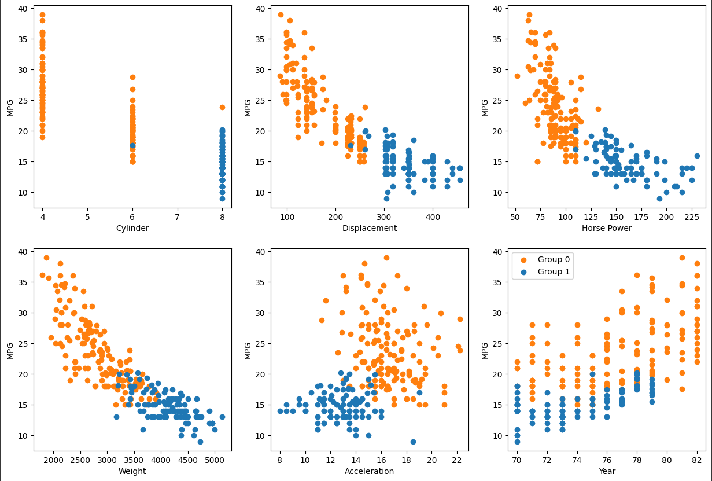

## The Cars of the World 1970 - 1982

This is an analysis of internal combustion automobiles of various national origins. This analysis will focus on identifying factors influencing fuel efficiency and stereoyping cars. 

***

## Introduction 

This dataset embodies a critical point in automotive history where due to the 1973 Oil Crisis and strengthening air quality controls american car makers were forced to downsize and promote efficiency. Exploring this period might offer relevant information to the current task of emissions reduction. We might also learn about the historical transformation these cars underwent.  

The techniques  of analysis used are linear regression and k means clustering. First, we will use linear regression to try and predict fuel efficiency of cars from the qualities described by the data set. Then, we will use K means clustering to create car stereotypes and examine what composes them.

We did this to solve the problem. We concluded that...

## Data

The data used comes from the UCI machine learning repository linked here: https://archive.ics.uci.edu/dataset/9/auto+mpg
It is a space separated data file containing a list of qualities of 398 cars from the United States, Europe, and Japan. 
The qualities listed in order: combined fuel efficiency in miles per gallon, number of cylinders, displacement in cubic inches, horse power, weight in pounds, zero to sixty in seconds, model year, place or origin, and model name. 

The data as received required some correction and paring down. Some horsepower data was missing and was corrected via google search. The data set contained 9 diesel and 3 rotary engine cars which were thrown out in order not to throw off a fuel efficiency prediction, diesel engines are naturally more fuel efficient than gas engines, while rotary engines are highly inefficient for their small displacement. I would have liked to make diesel another attribute to predict fuel efficiency from, however the small sample size makes this futile.

## Ridge Regression

For ridge regression we use every quantity (discarding model name and origin) provided to predict fuel efficiency. First we sample 100 random cars without replacement to be our test cars, the remainder are put into the training pool. The benefit of this randomness is the ability to continually resample and make sure the level of error in our predictions isn't a fluke of the specific cars sampled. This also has a knock on effect of giving us a more accurate idea of the appropriate weights for our quantities. If I had more time this would be systematized to give average error and weights. Once we have our training and test data we scale the data and run ridge regression.

[This is a typical sample of training data, scaled element weights, and root mean squared error.]

The element weights are in order with the elements of the training data. While all the elements have some substantial weight this is misleading, over repeated sampling the only elements that have a consistent significant weight are weight and model year. Weight always has a significantly negative weight and year always has a significantly positive weight. This makes sense, increased weight means an increased inertia that must be overcome with a loss of fuel efficiency. On the other hand, as the 70s progressed the oil crisis and clean air regulations drove the efficiency of new cars up year after year. We will further confirm these relationships in the K means section.

[This is a table of our regression results and errors. Underneath is a distribution of error sorted lowest to highest.]

[VW pickup and Dodge Rampage compared
MPG, # Cylinders, Displacement, Horse Power, LBS, 0-60, Year, Origin, Model Name]

Our RMSE hovers about 3 never more than 1 away. As seen from the figure there seems to be a couple of hard to explain spoilers in this test set like the 82 VW pickup. When compared with the 82 Dodge Rampage (a similar small pickup) we can see the 82 VW pickup is very similar in weight and has the same year leading to a similar predicted efficiency. The increased actual efficiency of the VW must come from the much smaller more efficient engine. I don't know why the model does not weigh smaller engines as more fuel efficient despite the obvious correlation to be shown in the K means section.

After eliminating all foreign cars from the data set the RMSE becomes much more stable at around 2.3. The weights also spread out more to more spread out and consistent. My hunch that foreign cars threw off the ridge regression is vindicated, however I still do not understand why this is the case. 

## K Means Clustering

We cluster using every quantity we have save model year. The data is scaled appropriately before clustered, otherwise the data would cluster solely around weight due to its larger magnitude.

[These are pie charts representing the group distribution of each origin group.]

We can see that group one is entirely endemic to the United States, while group zero cars can come from every region. We will call group one "land yachts" and group zero "econoboxes". We choose to use 2 clusters because the addition of more clusters doesnt add new information, the division between the american land yacht and all other cars does not become more visible.

[These are scatter plots with inputs: weight, year, and displacement and output miles per gallon. Cluster zero points are blue and cluster one points are orange.]

We can see from these graphs the negative correlations of weight and displacement with respect to miles per gallon  

## Conclusion

Here is a brief summary. From this work, the following conclusions can be made:
* first conclusion
* second conclusion

Here is how this work could be developed further in a future project.

## References
[1] DALL-E 3

[back](./)
