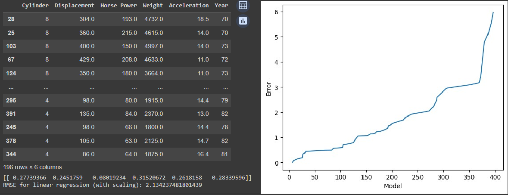

## The Cars of the World 1970 - 1982

This is an analysis of internal combustion automobiles of various national origins. This analysis will focus on identifying factors influencing fuel efficiency and stereoyping cars. 

***

## Introduction 

This dataset embodies a critical point in automotive history where due to the 1973 Oil Crisis and strengthening air quality controls american car makers were forced to downsize and promote efficiency. Exploring this period might offer relevant information to the current task of emissions reduction. We might also learn about the historical transformation these cars underwent.  

The techinques of analysis used are linear regression and k means clustering. First, we will use linear regression to try and predict fuel efficiency of cars from the qualities described by the data set. Then, we will use kmeans clustering to create car stereoypes and examine what composes them.

We did this to solve the problem. We concluded that...

## Data

The data used comes from the UCI machine learning repository linked here: https://archive.ics.uci.edu/dataset/9/auto+mpg
It is a space seperated data file containing a list of qualities of 398 cars from the United States, Europe, and Japan. 
The qualities listed in order: combined fuel efficiency in miles per gallon, number of cylinders, displacement in cubic inches, horse power, weight in pounds, an acceleration value, model year, place or origin, and model name. 

The data as recieved required some correction and paring down. Some horsepower data was missing and was corrected via google search. The list of cars contained 7 diesel cars which were thrown out in order not to throw off a fuel efficiency prediction as diesel engines are naturally more fuel efficient than gas engines. I would have liked to make diesel another attribute to predict fuel efficiency from, however the small sample size makes this futile. 

## Ridge Regression

For ridge regression we use every quantity (discarding model name and origin) provided to predict fuel efficiency. First we sample 100 random cars without replacement to be our test cars, the remainder are put into the training pool. The benifit of this randomness is the ability to continually resample and make sure the level of error in our predictions isnt a fluke of the specific cars sampled. This also has a knock on effect of giving us a more accurate idea of the appropriate weights for our quantities. If I had more time this would be systematized to give average error and weights. Once we have our traing and test data we scale the data and run ridge regression.


Figure X shows... [This is a typical sample of training data, scaled element weights, and root mean squared error.].

The element weights are in order with the elements of the training data. While all the elements have some substantial weight this is misleading, over repeated sampling the only elements that have a consistent signifigant weight are weight and model year. Weight always signifigantly negative weight and year always has a signifigantly positive weight. This makes sense, increased weight means an increased inertia that must be overcome with a loss of fuel efficiency. On the other hand, as the 70s progressed the oil crisis and clean air regulations drove the efficiency of new cars up year after year. We will further confirm these relationships in the K means section.



```python
test_data = mpg_data.sample(n = 100, replace = False, axis = 0) #random sample of the cars
train_data = mpg_data.drop(test_data.index, axis = 0) #remaining cars not sampled

X_train = train_data.drop(["MPG", "Model", "Country Of Origin"], axis = 1)
Y_train = train_data.loc[:,"MPG"]

X_test = test_data.drop(["MPG", "Model", "Country Of Origin"], axis = 1)
```

This is how the method was developed.

## K Means Clustering

Figure X shows... [description of Figure X].

## Conclusion

Here is a brief summary. From this work, the following conclusions can be made:
* first conclusion
* second conclusion

Here is how this work could be developed further in a future project.

## References
[1] DALL-E 3

[back](./)
